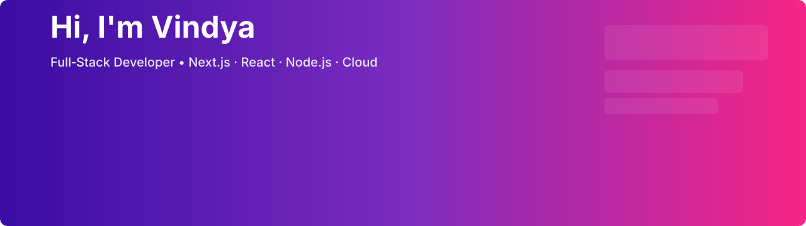
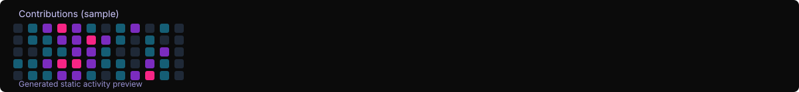

	<!-- Banner placeholder (replace with your banner image URL) -->
	

	<h1>Hi — I'm Vindya Kodithuwakku 👋</h1>
	
<strong>Full‑Stack Developer</strong> · Next.js · React · Node.js · Cloud

---

About
—
I build production-ready web apps with strong UX and performance. I combine modern frontends (Next.js/React) with robust backends (Node/Express) and cloud deployments. I enjoy integrating AI features into real products.

---

Tech stack (visual)
—

	<!-- skillicons.dev used for compact tech icons -->
	

Core skills
- Frontend: Next.js, React, Tailwind CSS
- Backend: Node.js, Express, REST APIs
- Data & Cloud: MongoDB, PostgreSQL, AWS
- Tools: Git, Vercel, Postman, Figma

---

---

---
---
Selected projects (short)
—
- Smart Mobile Ticketing Platform — maintenance workflow (Node.js, PostgreSQL, AWS)
- NovaScript — AI research tooling (React, Node.js, Gemini API)
- Multi-Vendor E‑commerce — marketplace (Next.js, Tailwind)

Tip: Pin 4–6 repos (frontend, backend, AI, capstone).

---

Certifications & achievements
—
- Google AI Essentials (Coursera)
- Semi-finalist — Brainstorm 2025 (SmartMedix)
- Semi-finalist — SLIoT Challenge 2025 (Sensora)

---

Connect
—

	
	
	

Note: contact via LinkedIn / GitHub (no phone/email displayed).

---
---

<!-- Minimal, visual profile layout -->

<!-- Ultra README: visually rich profile inspired by samples -->

	

	

		
	

	<h1 style="margin-top:12px;">Hi there 👋, I'm <strong>Vindya Kodithuwakku</strong></h1>
	
Full‑Stack Developer • Next.js · React · Node.js · Cloud

	<!-- Social badges -->
		

			
			
			
			
		

	<!-- Short intro and random dev quote -->
	
I build fast, accessible web apps and enjoy integrating AI features where they make sense. Currently focused on full-stack projects and deploying production-ready systems.

	

	<!-- Tech icons -->
	

		
	

	<!-- Stats / streaks / languages (collapsible style) -->
	

		
📊 Github stats & activity (click to expand)

		

			
			
			
		

	

	<!-- Pinned project cards -->
	<h3 style="margin-top:22px">⭐ Featured projects</h3>
		

			
			
			
			
			
		

	<!-- Activity graph (requires the profile-3d-contrib or similar) -->
	<h3 style="margin-top:22px">📈 Activity</h3>
	

		
	

	
Want this customized (different colors, illustration style, or different pinned repos)? Reply with your choices and I'll update everything.

What I’m looking for
—
- Internship / junior dev roles in web development
- Collaboration on AI + web projects and cloud deployments

---

Small wins & next steps
—
- Pin your 4–6 best repos (showcases) — pick one frontend, one backend, one AI project, etc.
- Add a short demo (link or GIF) and a minimal README to each pinned repo (1–2 minutes to scan)
- Use a clean banner and a sharp avatar to improve first impressions (I can design both)

Which would you like next? Reply with the number:
1) I’ll create a profile banner + avatar crop (I'll add placeholder images and update `README.md`).
2) I’ll generate a polished README for one of your repos — reply with the repo name.
3) I’ll change/remove the GitHub stats cards or switch their theme.

Tell me 1, 2 + repo, or 3 and I’ll do it next.
